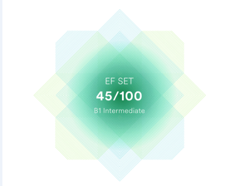

#Maria Stachovski 

***
### Junior Frontend Developer
***
###Contact information:
__Phone:__ +375293550605  
__E-mail:__ [maria.stachovski.de@gmail.com]   
__Github:__ MariStakhovskaya   
__Telegram:__ @MariaStakhovskaya
***
###About myself:
My goal is to become a professional front-end developer.
Every day I learn programming: javascript, react. 
The more I learn, the more I like it.
In parallel with the study, I make my portfolio and portfolio projects.
My strengths: passion for programming, responsibility, attention to detail,
I can be both a team player and an independent work unit. 
Expensive master going. And I go to the job of my dream's step by step.
***
###Skills:
HTML, CSS  
JS  
React  
Redux  
Git, Github  
Vs code, WebStorm  

***
###Code example:

***

###languages:
* English: A2/B1 (in progress)    
(https://www.efset.org/cert/mv94Ay)
  
* Russian: Native  
* German: A1/A2 (in progress)  

***

