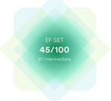

#Maria Stachovski 


***
### Junior Frontend Developer
***
###Contact information:
__Phone:__ +375293550605  
__E-mail:__ <maria.stachovski.de@gmail.com>  
__Github:__ MariStakhovskaya   
__Telegram:__ @MariaStakhovskaya
***
###About myself:
My goal is to become a professional front-end developer.
Every day I learn programming: javascript, react. 
The more I learn, the more I like it.
In parallel with the study, I make my portfolio and portfolio projects.
My strengths: passion for programming, responsibility, attention to detail,
I can be both a team player and an independent work unit. 
Expensive master going. And I go to the job of my dream's step by step.
***
###Skills:
   
    
  
  
  
  


***
###Code example:
[Kata 7kyu](https://www.codewars.com/kata/554b4ac871d6813a03000035/javascript) 

In this little assignment you are given a string of space separated numbers, and have to return the highest and lowest number.
```javascript
function highAndLow(numbers){
    let arr = numbers.split(' ').map(el => +el)
    let max = Math.max(...arr)
    let min = Math.min(...arr)
    return max + ' ' + min
}
```
[](https://www.codewars.com/users/MariStakhovskaya)

***

###Languages:
* English: A2/B1 (in progress) 
[Certificate efset.org](https://www.efset.org/cert/mv94Ay)  
  
* Russian: Native  
* German: A1/A2 (in progress)  

***


